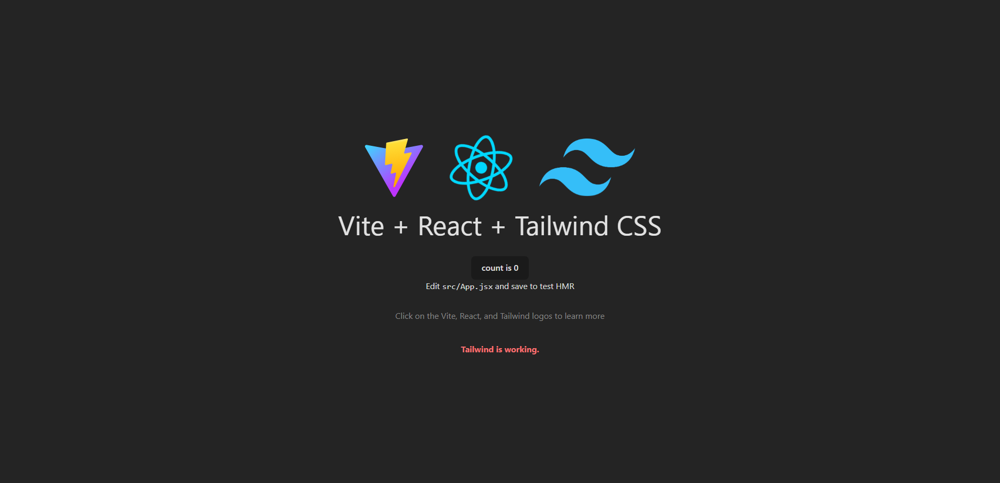

 

"[React](https://react.dev/) lets you build user interfaces out of individual pieces called components. Create your own React components like `Thumbnail`, `LikeButton`, and `Video`. Then combine them into entire screens, pages, and apps."

This guide provides a first-hand experience on building a **React** project using [Vite](https://vitejs.dev/guide/#scaffolding-your-first-vite-project) + [Tailwind CSS](https://tailwindcss.com/) and deploying it on [GitHub Pages](https://pages.github.com/).

## 🛠️ Installation

**1. Create your project.**

```bash
 # terminal
 npm create vite@latest project_name -- --template react
 cd project_name
```

**2. Install Tailwind CSS.**

```bash
# terminal
npm install -D tailwindcss postcss autoprefixer
npx tailwindcss init -p
```

**3. Configure your template paths.**

```js
// tailwind.config.js
/** @type {import('tailwindcss').Config} */
module.exports = {
  content: ['./src/**/*.{js,jsx,ts,tsx}'],
  theme: {
    extend: {},
  },
  plugins: [],
};
```

**4. Add the Tailwind directives to your CSS.**

```css
/* index.css */
@tailwind base;
@tailwind components;
@tailwind utilities;
```

**5. Start build process.**

```bash
# terminal
npm run dev
```

**6. Happy coding. ^^**

```jsx
<p className="text-red-400 font-bold mt-10">Tailwind is working.</p>
```

## 🗂️ File Structure

Simple file structure example by grouping `file types`.

```
src/
├── assets/
├── api/
├── configs/
├── components/
│ ├── SignUpForm.tsx
│ ├── Employees.tsx
│ ├── PaymentForm.tsx
│ └── Button.tsx
├── hooks/
│ ├── usePayment.ts
│ ├── useUpdateEmployee.ts
│ ├── useEmployees.ts
│ └── useAuth.tsx
├── lib/
├── services/
├── states/
└── utils/
```

## 🛫 How to deploy to GitHub Pages

Deploying to github pages is totally up to you, be it through **[GitHub Actions](https://docs.github.com/en/actions/deployment/about-deployments/deploying-with-github-actions)**, or via **[gh-pages](https://www.npmjs.com/package/gh-pages)** package, or manually.

> [!NOTE]
>
> Also take note that [GitHub Pages](https://pages.github.com/) have limitations, it's free, yes, but it has a limit.

### ❗ via package ❗

**1. Install `gh-pages` package.**

```bash
npm install gh-pages --save-dev
```

**2. Modify file paths.**

```html
<!-- index.html -->

<link rel="icon" type="image/svg+xml" href="./vite.svg" />
<script type="module" src="./src/main.jsx"></script>
```

**3. Add base path to your repo in `vite.config.js`.**

```js
// vite.config.js
import { defineConfig } from 'vite';
import react from '@vitejs/plugin-react';

// https://vitejs.dev/config/
export default defineConfig({
  plugins: [react()],
  base: '/react', // repo name
});
```

**4. Add `deploy` to your scripts.**

```json
{
  "scripts": {
    "deploy": "npm run build && gh-pages -d dist"
  }
}
```

**5. Create and configure a new branch for `gh-pages`.**

> [!IMPORTANT]
>
> Make sure that you have committed your changes before doing this. All untracked and staged files may be deleted.

I like to do this manually. If there is some automated way, feel free to let me know by any means.

```bash
git checkout --orphan gh-pages
git reset --hard
git commit --allow-empty -m 'commit_message'
git push origin gh-pages
```

**6. Publish the production build.**

```bash
npm run deploy
```

### ❗ via manually configuring github pages settings ❗

**1. Create your project.**
Start coding your project, either use a framework like React, Vue, or not.

**2. Publish production build to GitHub.**
Push your _production build_ to your github repo. After that, check if your `index.html` file is uploaded, since it is one of the core files needed for your website to work.

**3. Configure your GitHub Pages on repo Settings.**
Navigate to `Settings > Pages > Build and deployment`. Make sure the **Source** says 'Deploy from a branch', and then configure the **Branch** settings and change it to your branch with the files.

---

🌎 [kerbethecoder](https://kerbethecoder.com/)  
📫 krby.cnts@gmail.com  
📌 July 30, 2024
